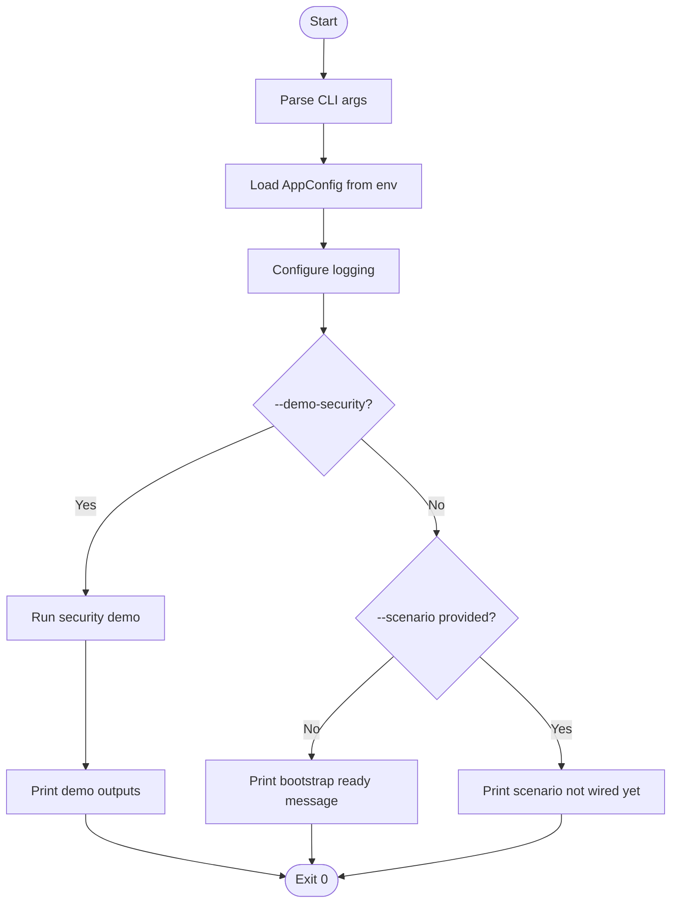
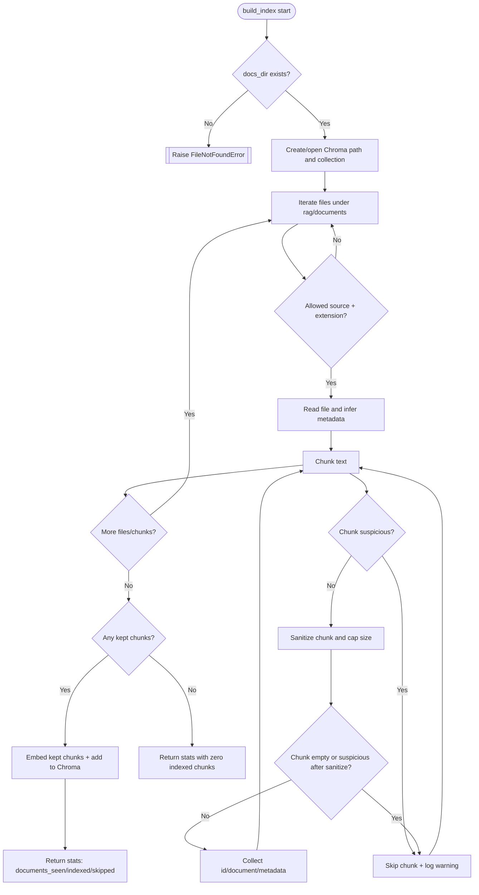

# Activity Diagram - Current System (Phase 0 to Phase 5)

This file captures the implemented runtime paths and guardrail branches as of Phase 5.

## 1) Main CLI Activity (`src/main.py`)



## 2) Security Demo Activity (PII + Language + Output Guard)

```mermaid
flowchart TD
    A([Security demo start]) --> B[Build sample CaseState]
    B --> C[redact_for_triage(email_body)]
    C --> D{PII found?}
    D -- Yes --> E[Add events: PII_REDACTED + entity-specific events]
    D -- No --> F[Add event: PII_REDACTION_NOT_NEEDED]
    E --> G[detect_language(redacted_body)]
    F --> G

    G --> H[choose_response_language(detected, preferred)]
    H --> I{Detected language valid?}
    I -- Yes --> J[Event: LANGUAGE_DETECTED_FR or EN]
    I -- No --> K{Preferred language valid?}
    K -- Yes --> L[Events: LANGUAGE_FALLBACK_TO_MEMORY + LANGUAGE_SELECTED_FR/EN]
    K -- No --> M[Event: LANGUAGE_DEFAULTED_EN]
    J --> N[apply_output_guard(subject, body, attempt_sanitize=True)]
    L --> N
    M --> N

    N --> O{Initial guard pass?}
    O -- Yes --> P[Event: OUTPUT_GUARD_PASSED]
    O -- No --> Q[Events: OUTPUT_GUARD_FAILED + violation events]
    Q --> R{Sanitized pass?}
    R -- Yes --> S[Events: OUTPUT_GUARD_SANITIZED + OUTPUT_GUARD_PASSED]
    R -- No --> T[Event: OUTPUT_GUARD_FALLBACK_REQUIRED]

    P --> U[Set state.output_guard_passed=True]
    S --> U
    T --> V[Set state.output_guard_passed=False]
    U --> W[Print redacted input, language, guard result, security_events]
    V --> W
    W --> X([Security demo end])
```

## 3) Tool Registry Activity (`tools/registry.py`)

```mermaid
flowchart TD
    A([call_tool start]) --> B{Tool exists in registry?}
    B -- No --> C[[Raise KeyError]]
    B -- Yes --> D{Role allowed for tool?}
    D -- No --> E[[Raise ToolPermissionError]]
    D -- Yes --> F[Validate input payload with Pydantic]
    F --> G{Input valid?}
    G -- No --> H[[Raise ValidationError]]
    G -- Yes --> I[Execute handler via retry()]
    I --> J[Validate handler output with Pydantic]
    J --> K{Output valid?}
    K -- No --> L[[Raise ValidationError]]
    K -- Yes --> M[Log success + return normalized dict]
    M --> N([call_tool end])
```

## 4) Memory Activity (`memory/store.py`)

```mermaid
flowchart TD
    A([record_finalize_update start]) --> B[upsert_case_memory(..., summary_payload)]
    B --> C{summary_payload contains raw email keys?}
    C -- Yes --> D[[Raise ValueError: raw email forbidden]]
    C -- No --> E[Write/Upsert case row]
    E --> F[get_ninety_day_compensation_total(customer_id)]
    F --> G[upsert_customer_memory(preferred_language, computed_total)]
    G --> H([record_finalize_update end])
```

## 5) RAG Index Build Activity (`rag/build_index.py`)



## 6) RAG Retrieval Activity (`rag/retriever.py`)

```mermaid
flowchart TD
    A([retrieve start]) --> B[Sanitize query]
    B --> C{Query empty after sanitize?}
    C -- Yes --> D[Return empty list]
    C -- No --> E[Embed query]
    E --> F[Query Chroma with language filter and fetch_k=max(top_k*3, top_k)]
    F --> G[Iterate candidates]
    G --> H{Internal source path?}
    H -- No --> I[Skip candidate + log warning]
    I --> G
    H -- Yes --> J{policy_type filter requested and matching?}
    J -- No --> K[Skip candidate]
    K --> G
    J -- Yes --> L[Sanitize snippet]
    L --> M{Snippet empty or suspicious?}
    M -- Yes --> N[Skip candidate + optional warning]
    N --> G
    M -- No --> O[Build structured result item with score]
    O --> P{Reached top_k?}
    P -- No --> G
    P -- Yes --> Q[Return result list]
    G --> R{No more candidates?}
    R -- Yes --> Q
```

## Notes
- The current implementation includes Phase 0-5 components only.
- Graph orchestration nodes (`ingest_email_node`, `triage_router_node`, etc.) are planned for later phases.
- Some test output still prints retrieved items because of debug prints in `tests/test_rag_pipeline.py`.

